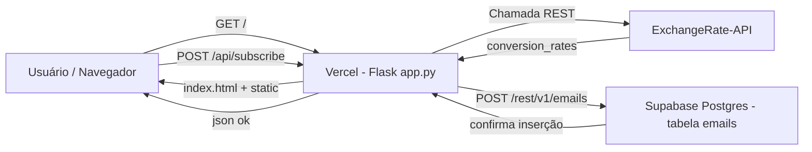

# Fluxograma da Aplicação — App_Cotacao

Flowcharts abaixo em [Mermaid](https://mermaid.js.org/). Para visualizar no VS Code:

1. Instale a extensão **Markdown Preview Mermaid Support** (de Matt Bierner).
2. Abra este arquivo e use **Ctrl+Shift+V** (Preview) para renderizar os diagramas.

---

## 1. Fluxo de acesso à aplicação (rota `/`)

```mermaid
flowchart TD
    A[Usuário acessa a raiz da aplicação] --> B[GET /]
    B --> C{`get_exchange_rates()` busca na ExchangeRate-API}
    C -- Falha de rede / API key ausente --> D[Retorna dicionário vazio]
    D --> E{Rota index verifica se há cotações}
    C -- Sucesso --> F[Retorna cotações USD/BRL/EUR/JPY]
    F --> E
    E -- Não há cotações --> G[Renderiza index.html com mensagem de erro]
    E -- Há cotações --> H[Renderiza index.html com os valores]
```

---

## 2. Fluxo de cadastro de e-mail (frontend + backend + Supabase)

```mermaid
flowchart TD
    A[Página carregada com cotações] --> B{Já existe cookie app_cotacao_subscribed?}
    B -- Sim --> C[Overlay NÃO aparece / nada é exibido]
    B -- Não --> D[Aguarda 60 segundos de uso]
    D --> E[Overlay de cadastro aparece]
    E --> F{Usuário clica em "Cadastrar"?}
    F -- Não --> G[Pode fechar com o X e continuar usando]
    F -- Sim --> H[Envia POST /api/subscribe com o e-mail]
    H --> I{Backend valida formato do e-mail}
    I -- Inválido --> J[Retorna 400 invalid_email]
    J --> K[Frontend mostra "Informe um e-mail válido"]
    I -- Válido --> L{Supabase configurado?}
    L -- Não --> M[Retorna ok + queued (apenas loga)]
    M --> N[Frontend grava cookie e fecha overlay]
    L -- Sim --> O{`email_exists` consulta a tabela emails}
    O -- Erro de rede --> P[Retorna 503 unavailable]
    O -- Já existe --> Q[Retorna ok + already_subscribed]
    Q --> N
    O -- Não existe --> R[Insere e-mail no Supabase POST /rest/v1/emails]
    R -- Sucesso 200/201 --> S[Retorna ok]
    S --> N
    R -- Falha --> P
    N --> T[Próximas visitas: cookie impede novo cadastro]
```

---

## 3. Visão geral de arquitetura (como os componentes conversam)



---

### Legenda de fluxos de decisão

| Símbolo | Significado |
|---------|-------------|
| Diamante | Decisão / condição |
| Retângulo | Ação / processo |
| Início/Fim | Ponto de entrada ou término |

**Para editar:** altere o texto dentro dos blocos acima e o preview atualiza automaticamente.
